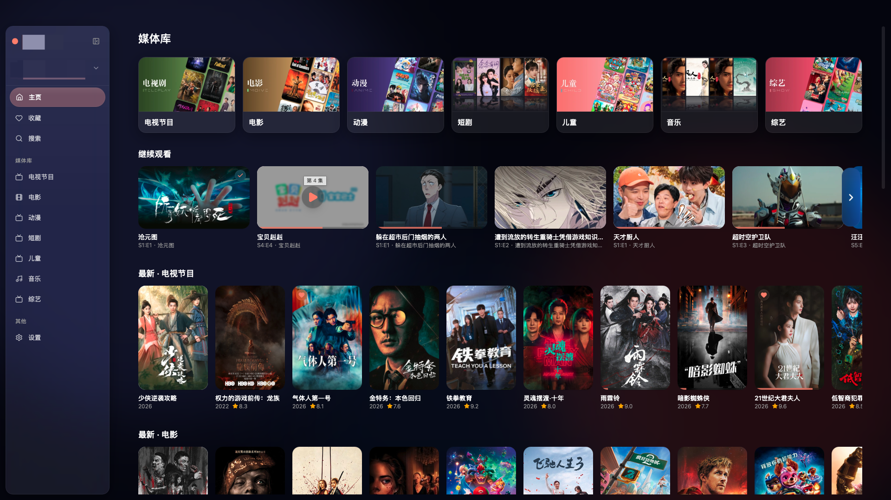
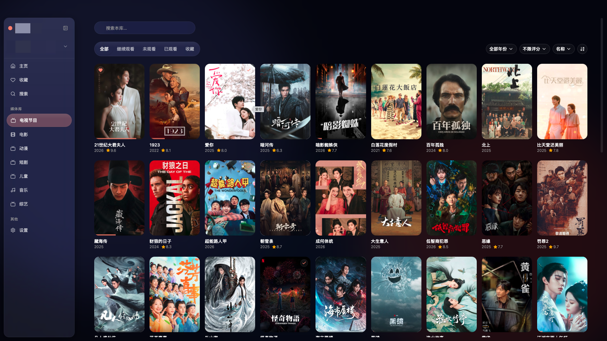
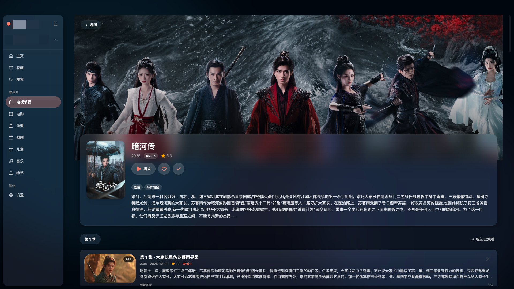
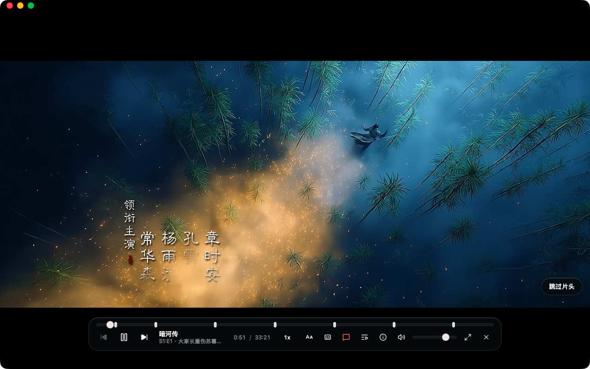
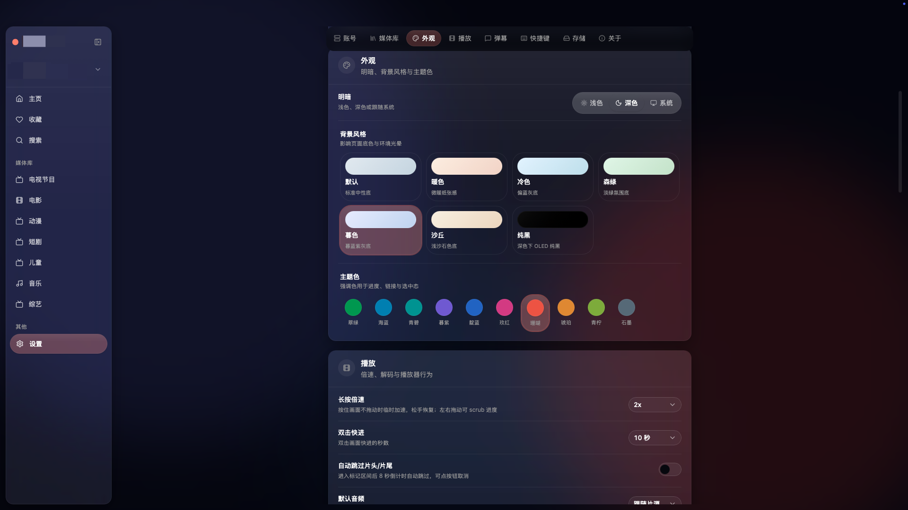

# Harbor

[中文](README.md) | **English**

A native desktop client for [Emby](https://emby.media/) and [Jellyfin](https://jellyfin.org/), with compatibility for [极影视](https://www.zspace.cn/) (limited testing).

Harbor is built for everyday desktop use: browse your libraries, continue where you left off, and play with embedded **libmpv**. Optional danmaku is available from danmu_api–compatible sources you configure yourself.

---

## Screenshots

### Home

### Library

### Detail

### Player

### Settings

---

## Features

- **Libraries** — browse views, folders, series, movies, and box sets
- **Continue watching & Next Up** — resume playback; remove items from resume when needed
- **Native playback** — embedded libmpv on macOS and Windows
- **Subtitles** — server subtitle tracks and local external subtitle files
- **Danmaku (optional)** — multiple danmu_api–compatible sources, heatmap seek, in-player source picker
- **Desktop experience** — macOS overlay title bar; Windows frameless custom title bar
- **Themes** — light / dark / system, with multiple accents and backgrounds
- **Secure session** — server credentials and tokens stored in the system keyring

---

## Platforms

| Platform | Notes |
|----------|--------|
| macOS 26+ (Apple Silicon / Intel) | Overlay title bar; native playback bundled with the app |
| Windows 10+ (x64) | Frameless window; native playback bundled with the app |

Current installers support **Windows 10** (x64) and **macOS 26** or later (**Apple Silicon and Intel**).

---

## Supported media servers

| Server | Notes |
|--------|--------|
| [Emby](https://emby.media/) | Primary target |
| [Jellyfin](https://jellyfin.org/) | Supported |
| [极影视](https://www.zspace.cn/) | Compatible, but lacking thorough testing |

---

## Requirements

- An Emby / Jellyfin server you can reach over the network (极影视 may work; stability is not fully verified)
- Windows 10+ (x64), or macOS 26+ (Apple Silicon / Intel)

---

## Get started

1. Download the latest `.dmg` (macOS) or installer / zip (Windows) from [Releases](https://github.com/envyafish/Harbor/releases).
2. Open Harbor and sign in with your server URL, username, and password.

---

## Privacy & security

- Credentials and access tokens are stored in the system keyring.
- Harbor connects only to **your** media server. It does not require a Harbor cloud account.
- If danmaku is enabled, requests go only to servers **you** configure. Harbor does not send danmaku.

---

## Feedback

Bug reports and feature requests are welcome via [GitHub Issues](https://github.com/envyafish/Harbor/issues).

Source code is not publicly available.

---

## Sponsor

If Harbor is useful to you, you can support the project via the [shop](https://pay.ldxp.cn/shop/767OK1ZS):

---

## License

Proprietary. All rights reserved.

---

## Acknowledgements

- [Emby](https://emby.media/)
- [Jellyfin](https://jellyfin.org/)
- [极影视](https://www.zspace.cn/)
- [mpv](https://mpv.io/) / libmpv
- [Tauri](https://tauri.app/)
- [danmu_api](https://github.com/huangxd-/danmu_api) and compatible danmaku providers
- [弹弹play](https://www.dandanplay.com/) open platform (protocol compatibility)
